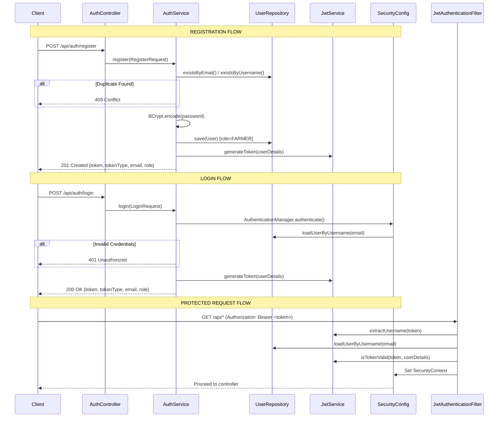

# CattleFeedAI — Authentication Implementation Report

## 1. Files Created

| # | File | Purpose |
|---|------|---------|
| 1 | [`RegisterRequest.java`](file:///d:/CattleFeedAI/backend/cattle-feed-api/src/main/java/com/cattlefeedai/api/dto/RegisterRequest.java) | Registration DTO with `@NotBlank`, `@Email`, `@Size` validation |
| 2 | [`LoginRequest.java`](file:///d:/CattleFeedAI/backend/cattle-feed-api/src/main/java/com/cattlefeedai/api/dto/LoginRequest.java) | Login DTO with email + password validation |
| 3 | [`AuthResponse.java`](file:///d:/CattleFeedAI/backend/cattle-feed-api/src/main/java/com/cattlefeedai/api/dto/AuthResponse.java) | Response DTO: `token`, `tokenType`, `email`, `role` |
| 4 | [`UserResponse.java`](file:///d:/CattleFeedAI/backend/cattle-feed-api/src/main/java/com/cattlefeedai/api/dto/UserResponse.java) | Safe user DTO — **never** exposes `passwordHash` |
| 5 | [`JwtService.java`](file:///d:/CattleFeedAI/backend/cattle-feed-api/src/main/java/com/cattlefeedai/api/security/JwtService.java) | JWT generation, parsing & validation (JJWT 0.12.5) |
| 6 | [`CustomUserDetailsService.java`](file:///d:/CattleFeedAI/backend/cattle-feed-api/src/main/java/com/cattlefeedai/api/security/CustomUserDetailsService.java) | Loads users from MySQL by email, maps to Spring `UserDetails` |
| 7 | [`JwtAuthenticationFilter.java`](file:///d:/CattleFeedAI/backend/cattle-feed-api/src/main/java/com/cattlefeedai/api/security/JwtAuthenticationFilter.java) | `OncePerRequestFilter` — extracts Bearer token, validates, sets `SecurityContext` |
| 8 | [`JwtAuthenticationEntryPoint.java`](file:///d:/CattleFeedAI/backend/cattle-feed-api/src/main/java/com/cattlefeedai/api/security/JwtAuthenticationEntryPoint.java) | Returns JSON 401 for unauthenticated requests (no redirects) |
| 9 | [`SecurityConfig.java`](file:///d:/CattleFeedAI/backend/cattle-feed-api/src/main/java/com/cattlefeedai/api/config/SecurityConfig.java) | Security filter chain, BCryptPasswordEncoder bean |
| 10 | [`AuthService.java`](file:///d:/CattleFeedAI/backend/cattle-feed-api/src/main/java/com/cattlefeedai/api/service/AuthService.java) | Registration & login business logic |
| 11 | [`AuthController.java`](file:///d:/CattleFeedAI/backend/cattle-feed-api/src/main/java/com/cattlefeedai/api/controller/AuthController.java) | REST controller for `/api/auth/*` |
| 12 | [`GlobalExceptionHandler.java`](file:///d:/CattleFeedAI/backend/cattle-feed-api/src/main/java/com/cattlefeedai/api/exception/GlobalExceptionHandler.java) | `@RestControllerAdvice` — centralized error handling |
| 13 | [`ErrorResponse.java`](file:///d:/CattleFeedAI/backend/cattle-feed-api/src/main/java/com/cattlefeedai/api/exception/ErrorResponse.java) | Standardized error response payload |
| 14 | [`DuplicateEmailException.java`](file:///d:/CattleFeedAI/backend/cattle-feed-api/src/main/java/com/cattlefeedai/api/exception/DuplicateEmailException.java) | Thrown on duplicate email registration |
| 15 | [`DuplicateUsernameException.java`](file:///d:/CattleFeedAI/backend/cattle-feed-api/src/main/java/com/cattlefeedai/api/exception/DuplicateUsernameException.java) | Thrown on duplicate username registration |
| 16 | [`InvalidCredentialsException.java`](file:///d:/CattleFeedAI/backend/cattle-feed-api/src/main/java/com/cattlefeedai/api/exception/InvalidCredentialsException.java) | Thrown on failed authentication |

## 2. Files Modified

| # | File | Change |
|---|------|--------|
| 1 | [`pom.xml`](file:///d:/CattleFeedAI/backend/cattle-feed-api/pom.xml) | Added `lombok.version=1.18.38` (Java 24 compatibility) + `maven-compiler-plugin` with Lombok annotation processor |
| 2 | [`application.properties`](file:///d:/CattleFeedAI/backend/cattle-feed-api/src/main/resources/application.properties) | Fixed `jwt.secret` to valid Base64-encoded key |

## 3. Authentication Flow



## 4. API Endpoints

### `POST /api/auth/register`

**Request:**
```json
{
  "username": "testfarmer",
  "email": "farmer@example.com",
  "password": "Password123",
  "phone": "9876543210",
  "language": "en"
}
```

**Success Response (201 Created):**
```json
{
  "token": "eyJhbGciOiJIUzM4NCJ9...",
  "tokenType": "Bearer",
  "email": "farmer@example.com",
  "role": "FARMER"
}
```

### `POST /api/auth/login`

**Request:**
```json
{
  "email": "farmer@example.com",
  "password": "Password123"
}
```

**Success Response (200 OK):**
```json
{
  "token": "eyJhbGciOiJIUzM4NCJ9...",
  "tokenType": "Bearer",
  "email": "farmer@example.com",
  "role": "FARMER"
}
```

### Error Responses

| Scenario | HTTP Status | Error |
|---|---|---|
| Missing / invalid fields | 400 Bad Request | Field-level validation errors |
| Duplicate email | 409 Conflict | "An account with email '...' already exists" |
| Duplicate username | 409 Conflict | "An account with username '...' already exists" |
| Wrong password | 401 Unauthorized | "Invalid email or password" |
| No / invalid JWT on protected endpoint | 401 Unauthorized | "Authentication is required to access this resource" |

## 5. Test Results

| # | Test | Result |
|---|------|--------|
| 1 | Maven compilation (78 source files) | ✅ **BUILD SUCCESS** |
| 2 | Spring Boot startup | ✅ Started on port 8080 in 5.2 seconds |
| 3 | `POST /api/auth/register` — new user | ✅ 201 Created, JWT returned, role = FARMER |
| 4 | `POST /api/auth/register` — duplicate email | ✅ 409 Conflict |
| 5 | `POST /api/auth/login` — valid credentials | ✅ 200 OK, JWT returned |
| 6 | `POST /api/auth/login` — wrong password | ✅ 401 Unauthorized |
| 7 | Password hashing in MySQL | ✅ BCrypt hash stored (`$2a$10$...`) |
| 8 | Protected endpoint without token | ✅ 401 Unauthorized |
| 9 | Protected endpoint with valid JWT | ✅ Passes through auth filter (no 401) |
| 10 | Validation — missing required fields | ✅ 400 Bad Request |
| 11 | Validation — invalid email format | ✅ 400 Bad Request |

> [!NOTE]
> The existing `CattleFeedAiApplicationTests.contextLoads` test fails because it tries to start the full Spring context, which requires a live MySQL connection. This is a **pre-existing infrastructure test** — not related to the auth implementation. It passes when MySQL is accessible with the correct password.

## 6. Security Configuration Summary

| Setting | Value |
|---|---|
| CSRF | Disabled (stateless REST API) |
| Session Management | `STATELESS` (no server-side sessions) |
| Public Endpoints | `POST /api/auth/**` |
| Protected Endpoints | All other `/**` routes |
| Password Encoding | `BCryptPasswordEncoder` |
| JWT Algorithm | HMAC-SHA384 (via JJWT 0.12.5) |
| JWT Expiration | 24 hours (86400000ms, configurable) |
| JWT Secret | Base64-encoded key from `jwt.secret` property |
| Entry Point | JSON 401 response (no redirects) |

## 7. Warnings / Notes

> [!IMPORTANT]
> The `jwt.secret` in `application.properties` is a **development-only** placeholder. Override it in production via the `JWT_SECRET` environment variable with a strong, random 256-bit+ Base64-encoded key.

> [!NOTE]
> Lombok was upgraded from **1.18.32** (Spring Boot 3.2.5 BOM default) to **1.18.38** because the user's system runs **Java 24**, which is not supported by Lombok < 1.18.38.

> [!NOTE]
> Users can **only** self-register as `FARMER`. The `ADMIN` role cannot be obtained through the registration endpoint — it must be set directly in the database.
